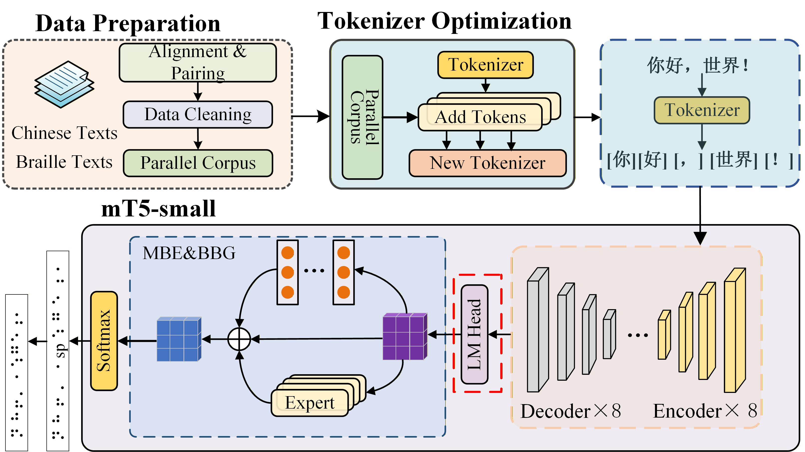

## Setup Environment
 
 We recommend using a conda environment to manage dependencies.
 
```bash
conda create -n braille_env python=3.10
conda activate braille_env
pip install -r requirements.txt
 ```
 
The installation of `pytorch` may vary depending on your system.  
Please refer to the [official website](https://pytorch.org) for more information.

All the training and evaluation scripts use `accelerate` to speed up the training process.  
If you want to run the scripts without `accelerate`, you can remove the related code in the scripts.  
Remember to run `accelerate config` before you run our scripts, or you may encounter some errors.

###  Add Braille Characters as New Tokens

Before fine-tuning, all Braille Unicode characters must be added to the mT5 tokenizer to ensure that the model can recognize and generate Braille symbols directly.

```bash
python down_model.py
```

### Training

The fine-tuning process is based on the mT5-small model that has been extended with Braille character tokens. After downloading and preparing the tokenizer with all unique Braille symbols from the dataset, the model is fine-tuned on the Chinese–Braille parallel corpus located in `Chinese_braille_data/Parallel Corpus`. The training uses the standard sequence-to-sequence objective of mT5, where the input is a Chinese sentence and the output is the corresponding Braille transcription. The fine-tuned model is saved to `save_model/` and can later be evaluated using the provided evaluation script.

```bash
bash train.sh
```
### Evaluate on the Validation and Test Set

The model evaluation is conducted on the validation and test sets in `Chinese_braille_data/Parallel Corpus`. During evaluation, the model generates Braille outputs, which are compared with the reference Braille texts to assess translation quality. BLEU is used as the primary metric to evaluate the model’s performance on the Chinese-to-Braille translation task. The evaluation is performed using the evaluation.sh script, and all results and logs are automatically saved to the `save_model/evaluation-final/` directory for further analysis and model comparison.

```bash
bash evaluation.sh
```

### Model Architecture

**Fig. 1. Model Architecture.**




## Reproducibility and Resource Release Plan

We highly value experimental reproducibility and transparency, and we appreciate the community’s interest in verifying and extending this work.

### Data availability

The Chinese–Braille parallel corpus used in this study was jointly constructed with a collaborating Braille school based on real teaching and learning scenarios. The dataset contains school-specific instructional materials as well as learning and usage records of visually impaired students.  
Due to collaboration agreements and privacy protection requirements, the full dataset cannot be publicly released at this time. We are currently in communication with the data providers and will explore feasible ways to make relevant parts of the dataset publicly available in the future, subject to appropriate compliance and privacy constraints.

### Planned public resources

To lower the barrier for experimental replication and to support reproducibility despite the above constraints, we are preparing the following resources for public release:

- Trained model checkpoints corresponding to the main experiments and ablation studies reported in the paper.
- Detailed configuration files specifying all training and evaluation hyperparameters.
- Executable scripts and step-by-step instructions for running training and evaluation under the same model architectures and settings.

These resources are currently being prepared and will be made publicly available in this repository in the near future.

The planned directory structure is as follows:

```text
checkpoints/   # trained model checkpoints (to be released)
configs/       # experiment configuration files
splits/        # data split identifiers (hashed, no raw text)

